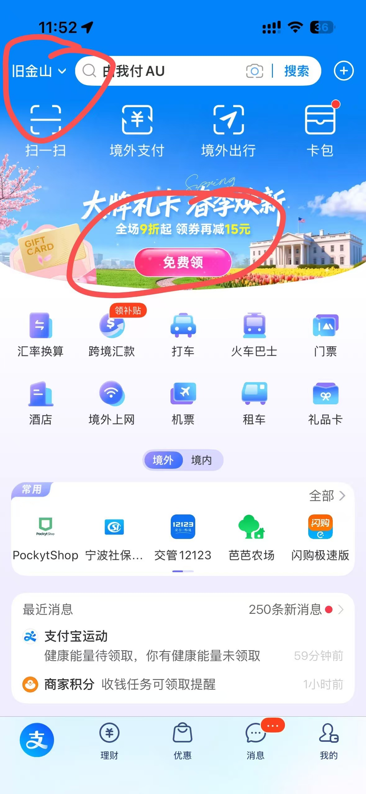
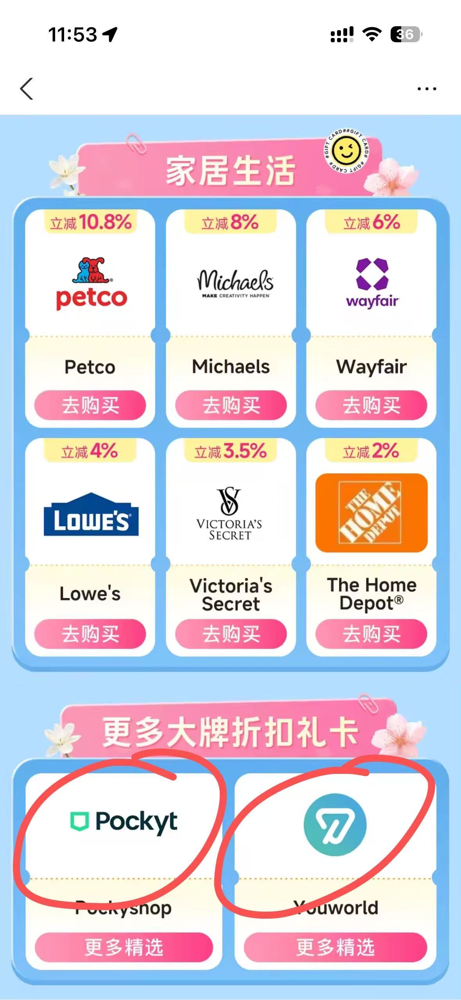
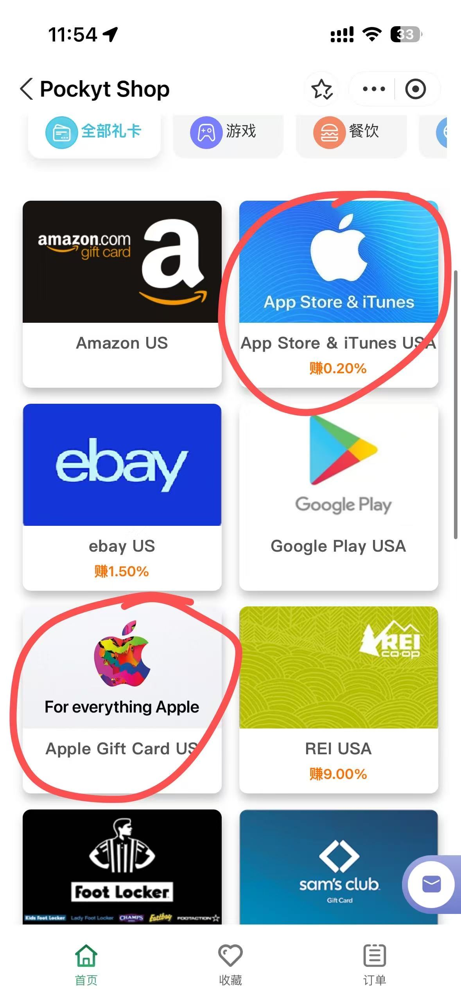

# 美区 Apple 账户充值与 App 内购订阅教程

> 作者：ymzhang
> 来源：由 `50-Content/草稿/2026-05-16 ChatGPT Plus 安全订阅文案/X - 美区 Apple 账户充值.md` 教程化整理。
> 适用对象：中国大陆用户，已经有美区 Apple Account，想通过美国区 Apple Gift Card 给账户充值，再用于 App Store 下载、App 内购或订阅。
> 核心路径：**美区 Apple Account -> 美国区 Apple Gift Card -> Apple Account Balance -> App Store / App 内购订阅**。

## 核对评估结论

原 X 长帖的主判断是成立的：对中国大陆用户来说，**直接把大陆发行的信用卡绑定到美区 App Store，不如用美国区 Apple Gift Card 充值 Apple Account Balance 稳定**。

需要补充和修正的地方：

1. 大陆 Visa / Mastercard 能境外支付，并不等于一定适合绑定美区 App Store。失败点通常出在账单地址、发卡行、地区匹配和 Apple 风控。
2. Apple 官方支持 Apple Account Balance 用于 App、游戏、App 内购买和订阅，但部分购买仍可能要求账户里有可用付款方式。
3. Apple Gift Card、App Store Card、App Store & iTunes Gift Card 必须按购买国家或地区兑换。美国区账号只能兑换美国区礼品卡。
4. 具体 App 的订阅入口、套餐限制和恢复购买规则不完全一样，仍以该 App 官方说明和 App Store 当前显示为准。
5. Apple 官网的 Guest Checkout 只是“不登录 Apple Account 结账”，不等于匿名购买；订单邮箱、付款卡、账单信息和风控验证仍可能被校验。

## 前提条件

| 项目 | 要求 |
|---|---|
| Apple 账号 | 已注册好的美国区 Apple Account |
| App Store 登录状态 | 当前 iPhone / iPad 的 App Store 已登录美区账号 |
| 网络 | 建议使用稳定美国网络环境，尤其是首次登录、兑换和购买时 |
| 礼品卡 | 美国区 Apple Gift Card / App Store & iTunes Gift Card |
| 兑换码 | 只接受兑换码，不接受代登、代充 |
| 目标 App | 已确认目标 App 支持美国区下载和 App 内购 |

## 为什么不建议直接绑定大陆信用卡

美区 Apple Account 对账号地区、账单地址、付款方式和风控环境有匹配要求。

大陆发行的 Visa、Mastercard、银联卡，即使能刷美元，也可能遇到：

- 添加付款方式失败。
- Billing Address 账单地址验证失败。
- 订阅扣款失败。
- 提示 `Verification Required`。
- 提示更新付款方式。
- 短时间内触发付款风控。

所以更稳的方式是：**不把大陆卡作为主要付款方式，改用美国区礼品卡充值余额。**

## 推荐充值路径

1. 准备一个可正常使用的美区 Apple Account。
2. 购买美国区 Apple Gift Card 或美国区 App Store & iTunes Gift Card。
3. 在 App Store 里兑换礼品卡代码。
4. 兑换金额进入 Apple Account Balance。
5. 用 Apple Account Balance 支付 App Store 购买、App 内购买或订阅。

一句话记忆：

**美区账号只兑换美区卡，充值后用 Apple 余额支付。**

## 购买礼品卡的渠道判断

优先级可以这样理解：

| 渠道 | 评估 |
|---|---|
| Apple 美国官网 | 最正规，可从官方 Apple Gift Card 页面购买，但可能对付款方式、账单信息和收件邮箱有要求 |
| 正规礼品卡平台 | 可选，重点看是否明确标注 `US` / `United States` 区域 |
| 支付宝国际版等渠道 | 可作为备选，购买前确认是否为美国区 Apple Gift Card |
| 第三方卖家 | 只买兑换码，不代登、不代充、不交 Apple 密码 |

### Apple 美国官网购买入口

官方购买页：

https://www.apple.com/shop/buy-giftcard/giftcard/100-dollars

这个链接是 Apple 美国官网的 `100 dollars` Apple Gift Card 页面。页面里通常也可以切换其他面额，实际可购买面额、收件邮箱、付款方式和订单校验，以 Apple 当前页面显示为准。

如果结账页提供 `Guest Checkout` / `Continue as Guest`，它只表示“不登录 Apple Account 结账”。这不是匿名充值，也不代表一定能下单成功。Apple 仍可能校验：

- 付款卡是否可用。
- 账单信息是否匹配。
- 收件邮箱是否可接收礼品卡邮件。
- 订单是否触发风控或取消。

### 支付宝国际版购买路径

支付宝国际版可以作为备选入口，按当前截图里的路径可以这样找：

1. 登录支付宝国际版后，先把左上角定位切到美国城市，一般选择旧金山。
2. 确认首页左上角显示 `旧金山`，再继续操作。
3. 点击首页的“大牌礼卡”等活动广告入口。
4. 进入活动页后，往下拉到靠后的“更多大牌折扣礼卡”区域。
5. 在这一段通常能看到 `PockytShop` 和 `YouWorld` 两个店铺入口。
6. 进入 `PockytShop` 后，可能会看到两个 Apple 相关礼品卡入口：`App Store & iTunes USA` 和 `Apple Gift Card USA`。
7. 当前截图里，靠上的 `App Store & iTunes USA` 显示 `0.20%` 优惠。
8. `YouWorld` 也可能显示 `0.20%` 优惠，但货源有时会售罄。

这里的 `0.20%` 只是页面当时显示，不是固定折扣。折扣、库存、可购买面额、支付方式、到账时间和售后规则，都以你购买时页面显示为准。

截图参考：

支付宝国际版购买前重点核对：

- 商品名称是否明确包含 `USA` / `US` / `United States`。
- 商品说明里是否写清楚适用于美国区 Apple Account。
- 是 `Apple Gift Card` / `App Store & iTunes USA`，不要买成其他国家或其他类型卡。
- 是否只交付兑换码，不需要你提供 Apple ID 密码。
- 是否能保存订单记录、兑换码记录和售后凭证。

购买前必须确认：

- 卡区是美国区，不是中国区、日本区、港区或其他区域。
- 商品类型是 Apple Gift Card / App Store & iTunes Gift Card，不是只能线下购物用的其他卡。
- 卖家能提供完整兑换码。
- 兑换码未使用、已激活。
- 有基本售后和购买凭证。

不建议：

- 低价明显异常的黑卡。
- 要求提供 Apple Account 密码的代充。
- 让别人远程登录你账号。
- 购买别人注册好的 Apple ID。
- 一次性囤大量余额。

## iPhone / iPad 兑换步骤

1. 打开美国网络环境。
2. 打开 `App Store`。
3. 确认右上角头像登录的是美区 Apple Account。
4. 点右上角头像。
5. 选择 `Redeem Gift Card or Code` / `兑换礼品卡或代码`。
6. 选择手动输入代码。
7. 输入美国区兑换码。
8. 点 `Redeem` / `兑换`。
9. 回到账户页查看 Apple Account Balance 是否变成美元余额。

如果看不到 `Redeem Gift Card or Code`，通常是没有登录 Apple Account，或者当前 App Store 账号状态异常。

## Mac 兑换步骤

1. 打开 `App Store`。
2. 登录美区 Apple Account。
3. 点击左下角账号名。
4. 点击 `Redeem Gift Card`。
5. 输入兑换码。
6. 确认兑换后检查余额。

## 如何检查余额

iPhone / iPad：

1. 打开 `App Store`。
2. 点右上角头像。
3. 查看账号下方是否显示美元余额。

部分设备也可以在 Wallet / 钱包里的 Apple Account Card 查看余额。

注意：Apple Account Balance 通常不能直接提现吗。除非当地法律要求，一般不能把未用余额兑换成现金，所以不要一次性充值过多。

## 具体 App 订阅教程

不同 App 的订阅入口、套餐限制和恢复购买规则不完全一样。比如 ChatGPT Plus 的 iOS App 内购流程，已单独整理为：

- [[40-Resources/教程/账号申请类/用美区Apple余额订阅ChatGPT Plus教程|用美区Apple余额订阅ChatGPT Plus教程]]

## 自动续费怎么处理

通过 Apple 订阅后，后续续费通常由 Apple 从可用付款方式中扣款。

建议：

1. 保持 Apple Account Balance 大于下一次订阅金额。
2. 续费日前检查余额。
3. 如果不想续费，提前在 iPhone 的订阅管理里取消。

取消路径：

1. 打开 `设置`。
2. 点顶部自己的 Apple 账号。
3. 进入 `订阅`。
4. 找到对应订阅项目。
5. 选择取消订阅。

## 常见问题

### 1. 提示兑换码必须在另一个国家或地区兑换

基本可以判断：卡区买错了。

美国区 Apple Account 只能兑换美国区礼品卡。其他地区礼品卡不能跨区兑换到美国区账号。

### 2. 提示兑换码无效

排查：

- 是否把 `0` 和 `O`、`1` 和 `I`、`5` 和 `S` 输错。
- 是否输入了序列号，而不是兑换码。
- 是否买到了错误类型的礼品卡。
- 是否复制时多了空格或换行。

### 3. 提示兑换码已兑换

处理：

- 先退出 App Store 再重新登录，刷新余额。
- 检查其他设备是否已经兑换过。
- 如果仍然无余额，联系卖家或 Apple Support，并准备购买凭证。

### 4. 提示礼品卡未激活

通常是零售商或卖家没有正确激活。优先找销售方处理。

### 5. 余额够，但 App 内购仍失败

可能原因：

- 目标 App 不支持当前地区。
- Apple 仍要求账号保留一个有效付款方式。
- 账号处于风控或验证状态。
- App 内购项目本身暂时不可用。

处理：

- 检查 App Store 账号地区是否仍是美国。
- 检查账单地址是否完整。
- 重新登录 App Store。
- 等待一段时间再试。
- 如果连续失败，不要高频点击购买，优先联系 Apple Support 或 App 官方支持。

## 避坑清单

- [ ] 不直接把 Apple ID 密码交给第三方。
- [ ] 不接受代登、代充。
- [ ] 不买来源不明的黑卡、低价异常卡。
- [ ] 不频繁退款。
- [ ] 不频繁切换国家和地区。
- [ ] 不购买别人注册好的 Apple ID。
- [ ] 不一次性充值过多余额。
- [ ] 不在已有订阅未取消时跨平台重复订阅。
- [ ] 保存礼品卡订单、兑换码和购买凭证。

## 最小成功检查表

- [ ] App Store 当前登录的是美国区 Apple Account。
- [ ] 兑换码明确是美国区。
- [ ] 可以在 App Store 中看到 `Redeem Gift Card or Code`。
- [ ] 兑换后余额显示为美元。
- [ ] 能下载目标 App。
- [ ] 能进入目标 App 的官方内购页面。
- [ ] 订阅确认页显示由 Apple 管理付款。
- [ ] 完成后能在 `设置 -> Apple 账号 -> 订阅` 中看到订阅项目。

## 官方参考

- [How to redeem your Apple Gift Card, App Store Card, or App Store & iTunes Gift Card](https://support.apple.com/en-us/118242)
- [If you can't redeem your Apple Gift Card, App Store Card, or App Store & iTunes Gift Card](https://support.apple.com/en-us/108285)
- [Check your Apple Account balance](https://support.apple.com/en-us/119902)
- [What you can buy with your Apple Gift Card or Apple Account balance](https://support.apple.com/en-us/118245)
- [Payment methods that you can use with your Apple Account](https://support.apple.com/en-us/111741)
- [Buy $100 Apple Gift Cards - Apple](https://www.apple.com/shop/buy-giftcard/giftcard/100-dollars)

## 相关笔记

- [[40-Resources/教程/账号申请类/中国大陆用户注册美国区App Store账号教程|中国大陆用户注册美国区App Store账号教程]]
- [[40-Resources/教程/账号申请类/用美区Apple余额订阅ChatGPT Plus教程|用美区Apple余额订阅ChatGPT Plus教程]]
